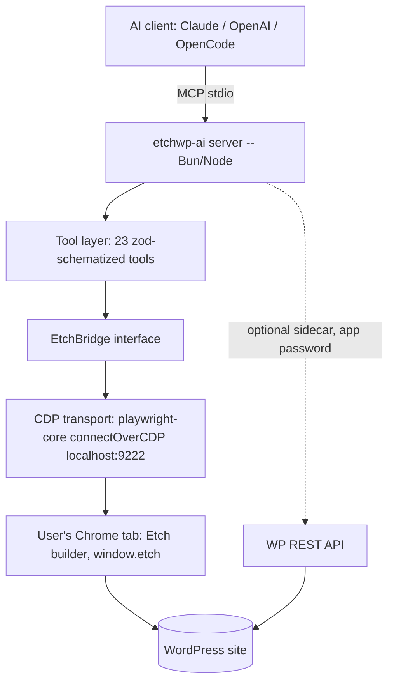

# PRD: etchwp-ai

> MCP server that lets any AI client (Claude, OpenAI, OpenCode, …) drive the Etch for WordPress builder through its Public API (`window.etch`), bridged over Chrome DevTools Protocol — with ACSS-token awareness on the roadmap.
> Generated on: 2026-06-12 · Grilled (v2): 2026-06-12 — 39 confirmed findings applied

---

## 1.0 Project Metadata

```yaml
# Identity
project_type: software
project_name: etchwp-ai
branch_name: feature/etchwp-ai-v1
loop_mode: interactive

# Designer-led mode
frontend_first: false            # server/CLI — no UI layer
platforms: []
gate_strictness: soft

# Tooling
package_manager: bun
test_runner: bun
typecheck_cmd: "bun run typecheck"   # tsc --noEmit
lint_cmd:      "bun run lint"        # biome check
test_cmd:      "bun test"
dev_cmd:       "bun run dev"
build_cmd:     "bun run build"       # bun build --target=node → dist/

# Git workflow
commit_convention: conventional
production_branch: main
use_worktrees:     false

# Loop behavior
max_iterations_default: 20
subagent_concurrency:   4
```

> ⚠️ Repo is not yet a git repository. Run `git init` before `/do-it:build` — the build loop commits per story.

**Research inputs (builders MUST read before implementing):**
- `.do-it/research/etch-api-map.md` — full Etch Public API capability map (contract `0.x`, docs dated 2026-06-11). Ground truth for every domain tool.
- `.do-it/research/acss-variables.md` — ACSS variable namespaces, origin-based classification strategy, collision list (required for F4).

---

## 1. Product Vision & Overview

### 1.1 Problem Statement

Etch is a modern WordPress page builder with a Public API — but that API exists **only as `window.etch` inside the live builder tab**. There are no REST endpoints. AI assistants therefore cannot build, restyle, or refactor Etch pages today: no MCP server, no connector, no bridge exists. Agencies (like Flying Web) that author sites in Etch + AutomaticCSS do every block, class, and loop by hand even though the API exposes ~70 scriptable operations.

### 1.2 Product Vision

`etchwp-ai` is a public, npm-distributed MCP server that attaches to the user's own Chrome tab via the Chrome DevTools Protocol and exposes the full Etch Public API as 23 well-schematized MCP tools. Any MCP-capable AI client — Claude (Desktop/Code), OpenAI (Agents SDK / Responses API), OpenCode, Cursor — can then read the block tree, create and style blocks, manage components, loops, fields, and stylesheets, see what it built via screenshots, and persist explicitly. v1 reads live design tokens by merging Etch's variable registry with a fixed read-only `:root` snapshot of the page (covering ACSS and any other plugin/theme tokens, classified by stylesheet origin); full ACSS-opinionated generation/validation is v2.

### 1.3 Target Audience

1. **Agency developer (primary)** — builds client sites in Etch + ACSS; wants AI to scaffold sections, apply BEM classes, wire loops, while they watch live in their own browser tab.
2. **Etch community tinkerer** — installs via `npx etchwp-ai`, connects Claude Desktop, automates repetitive builder work.
3. **AI tool builder** — uses etchwp-ai as the reference Etch integration inside larger agent pipelines (OpenAI Agents SDK, OpenCode).

### 1.4 Success Metrics

| Metric | Target | Measurement Method |
| ------ | ------ | ------------------ |
| End-to-end demo: AI builds a styled section (blocks + classes + save) from the canonical README prompt | Passes the named checks in the README verification script on a stock WP + Etch install | §6.3-2 protocol |
| Etch Public API coverage | 100% of documented `0.x` operations exposed (incl. `etch.ui` via `etch_ui`) | Generated coverage table CI-checked against the ops manifest (F14b) |
| Silent data loss incidents (unsaved buffer discarded without warning or explicit `discard`) | 0 | Dirty-flag tests, nav-guard tests, reload-detection test, disconnect-warning test |
| Install-to-first-tool-call time | < 10 min under the §6.3-1 timed onboarding protocol | §6.3-1 protocol, recorded |
| Client support | Claude Code + Claude Desktop verified; OpenCode + OpenAI Agents SDK configs documented | §6.3-6 CI handshake test + manual verification record |

---

## 2. User Stories & Personas

### 2.1 User Personas

- **Davide — agency owner/developer.** Goals: ship Etch client sites faster; AI does scaffolding, he does judgment. Pain: repetitive block/class/loop authoring; no API access from AI. Key actions: "build this section", "apply ACSS tokens", "wire this loop", review live, save.
- **Casey — Etch community member.** Goals: try AI-assisted building with minimal setup. Pain: no technical patience for fragile setups. Key actions: `npx etchwp-ai`, paste config into Claude Desktop, prompt.
- **Riley — agent-pipeline builder.** Goals: deterministic, well-schematized tools; clean errors. Pain: tools with vague schemas that models misuse. Key actions: register server in Agents SDK, compose with other tools.

### 2.2 User Stories

**Must Have**
- As a developer, I want the server to attach to my already-logged-in Chrome tab, so the **core tool requires no WordPress credentials** (the optional WP REST sidecar accepts an application password via env vars only — see §4.3, F12).
- As a developer, I want to read the full block tree of the current post so the AI understands the page before editing.
- As a developer, I want the AI to create/update/move/delete blocks, set text and attributes, and attach classes so it can build real sections.
- As a developer, I want CSS styles and live `:root` design tokens (Etch-registered and ACSS/theme-defined) readable — and Etch styles/variables writable — so generated CSS uses my real design system.
- As a developer, I want every buffered mutation flagged dirty and an explicit `etch_save` tool so nothing persists — or is lost — silently.
- As a developer, I want a status tool (active post, template vs post, component-edit mode, dirty state, canUndo) so the AI never acts on a stale assumption.
- As a developer, I want screenshots of the builder so the AI sees what it built.
- As a user, I want structured errors with stable codes and remediation text (Chrome not found, debug port closed, multiple candidate tabs, Etch not on page, `NOT_AVAILABLE`, `WRONG_BLOCK_TYPE`) so I can fix setup myself.

**Should Have**
- As a developer, I want a composite "insert pattern" capability (HTML + CSS in → block tree + styles + classes out) so one call builds a whole section.
- As a developer, I want undo checkpoints and rollback so a botched AI batch can be reverted.
- As a developer, I want a WP REST sidecar (media upload, paginated post/page listing) to fill Etch API gaps.

**Could Have**
- As a developer, I want components, loops, and custom fields fully manageable so dynamic content is scriptable.
  *(Listed Could only relative to blocks/styles; still in v1 scope — see §6.)*

**Won't Have (v1)**
- ACSS-opinionated generation/validation (token-only CSS enforcement, utility suggestions) — v2.
- WP-plugin/WebSocket or browser-extension transports — v2 candidates behind the bridge interface.
- Multi-tab / multi-site sessions; managed (Playwright-launched) browser; headless autonomous login.

---

## 3. Features Breakdown

### 3.1 Feature Map

| #   | Feature | Priority | Complexity | Description |
| --- | ------- | -------- | ---------- | ----------- |
| F1  | CDP bridge core | Must | High | Attach to Chrome via CDP, deterministic tab discovery, eval `window.etch.*`, reload detection, raw screenshot + readRootVariables primitives |
| F2  | MCP server skeleton + status/save | Must | Medium | stdio MCP server, error envelope + code table, `etch_status`, `etch_save`, split dirty tracking, feature detection, CI workflow |
| F3  | Blocks domain | Must | High | `etch_blocks_read` / `etch_blocks_write` — block CRUD (create/replace = EtchBlockJson, update = BlockPatch), tree with size controls, classes, attributes, component edit mode incl. revert |
| F4  | Styles + tokens | Must | Medium | `etch_styles_read/write`, `etch_tokens` (merged Etch registry + `:root` snapshot, origin-classified) |
| F5  | Stylesheets domain | Must | Low | `etch_stylesheets_read/write` (immediate persistence) |
| F6  | Components domain | Must | Medium | `etch_components_read/write` (numeric IDs, partial patch; properties/blocks wholesale) |
| F7  | Loops domain | Must | Medium | `etch_loops_read/write` incl. query configs + `$param ?? default` mini-language |
| F8  | Fields domain | Must | Medium | `etch_fields_read/write` — groups, fields, values |
| F9  | Navigation, UI chrome + history | Must | Medium | `etch_nav` (dirty-guarded), `etch_ui`, `etch_history`; re-attach after navigation |
| F10 | Screenshot tool | Must | Low | `etch_screenshot` over the F1 bridge primitive, exact size guards |
| F11 | Undo checkpoint/rollback | Should | Low | `checkpoint`/`rollback` actions on `etch_history`, all-domain mutation counter |
| F12 | WP REST sidecar | Should | Medium | `wp_media`, `wp_content` via application password |
| F13a | Pattern transform engine | Should | High | Pure transform: HTML+CSS → validated insertion plan (no bridge calls) |
| F13b | Pattern orchestration tool | Should | Medium | `etch_insert_pattern`: executes a plan via bridge; manifest, partial-failure handling |
| F14a | Packaging + release pipeline | Must | Medium | npm dist, bin, npx smoke test, publish-on-tag CI, pack/handshake matrix test |
| F14b | Docs + coverage table | Must | Medium | README (setup, client configs, troubleshooting matrix), generated API coverage table |

### 3.2 Detailed Feature Specs

Acceptance criteria live per-feature in §7.1 (single source of truth — `/do-it:build` reads them there).

---

## 4. Technical Architecture

### 4.1 Tech Stack (approved 2026-06-12; parser + linter rows added at grill)

| Layer | Technology | Version | Rationale |
| ----- | ---------- | ------- | --------- |
| Runtime (dev) | Bun | latest stable | repo standard (CLAUDE.md), `bun test`, fast |
| Dist target | Node-compatible bundle via `bun build --target=node` | Node ≥ 20 | MCP clients spawn `npx etchwp-ai`; Bun-only kills adoption |
| Language | TypeScript | 5.x | mirrors `@digital-gravy/etch-public-api` contract types |
| MCP framework | `@modelcontextprotocol/sdk` | latest | official; stdio transport v1, Streamable HTTP later |
| CDP bridge | `playwright-core` `connectOverCDP` | latest | attach-not-launch, robust eval, screenshots, no browser download |
| Contract types | `@digital-gravy/etch-public-api` | matching `0.x` | official type contract; feature-detect at runtime |
| HTML parsing (F13a) | `htmlparser2` | latest | forgiving of AI-generated HTML; runs in the Node dist (in-page DOMParser is off-limits per the eval allowlist; Bun-only APIs unavailable in Node dist) |
| CSS parsing (F13a) | `css-tree` | latest | parse + walk CSS locally before any mutation |
| Validation | `zod` | 3.x/4.x | tool input schemas, one source of truth → JSON Schema |
| Lint/format | Biome | latest | single fast tool; `lint_cmd` in §1.0 |
| Tests | `bun test` + mock bridge | — | no live WP in CI |
| CI / publish | GitHub Actions → npm on tag | — | public-package discipline |

### 4.2 System Architecture



Key design rules:

1. **`EtchBridge` is an interface** — `eval(domain, method, args)`, `isAvailable()`, `screenshot(opts)`, `readRootVariables()`, lifecycle/navigation events. CDP is the v1 implementation; WP-plugin/WebSocket relay can slot in as v2 transport without touching the tool layer. The raw screenshot and root-variable capabilities live on the bridge (F1); F10/F4 are tool-layer consumers.
2. **No client-supplied JS, ever.** The bridge executes (a) generated calls against an allowlisted `window.etch.<domain>.<method>` surface, and (b) exactly one additional fixed, parameterless, server-shipped, read-only page function: `readRootVariables()` (a `document.styleSheets`/`getComputedStyle` snapshot of `:root` custom properties with owning-stylesheet hrefs). There is no `eval` tool and no other raw-JS path.
3. **Serialized command queue.** The API is stateful (selection, component edit mode, buffered saves); all bridge calls run through a single FIFO queue with per-call timeout (`ETCH_CALL_TIMEOUT_MS`, default 15000).
4. **Split dirty tracking, confirmed-success only.** `pageDirty` counts buffered mutations (blocks outside component-edit mode, styles, loops) since the last `etch_save`; `componentEditDirty` counts block mutations made while component-edit mode is active, cleared by `save_component_edit` or `exit_component_edit { revert: true }`. Counters increment **only on eval-confirmed success**; an indeterminate outcome (timeout, socket drop, context destroyed mid-eval) conservatively marks the domain dirty and sets `lastCallIndeterminate`, surfaced in `etch_status`. Dirty is defined as **a lower bound on unsaved state**: it counts AI-initiated mutations only — concurrent manual user edits and UI-initiated saves are not observable (the API has no events). This wording appears in `etch_status` output and tool descriptions. On client disconnect with a non-zero counter, the server writes a structured warning to **stderr** (stdout is the MCP protocol channel).
5. **Feature detection at startup.** API is `0.x` experimental — probe each method's existence (`typeof`), expose results in `etch_status.featureMap`, return `E_FEATURE_MISSING` per-action rather than crashing.
6. **Navigation safety.** `open_post` / `open_template` / `go_to` reload or replace the page context. Each is dirty-guarded (see F9). The bridge subscribes to CDP frame-navigation/document-load events: any document load **not** caused by a just-issued `etch_nav` action increments a session epoch, resets dirty counters, and causes the next tool call to fail once with `E_SESSION_RELOADED` (telling the AI its block/style IDs are dead) before normal operation resumes. `ui.exitToWordPress()` destroys the session — gated behind `confirm: true`.

### 4.3 Data Model

No database. Persistent state is WordPress's (via Etch). In-process state:

- `BridgeSession` — CDP endpoint, **pinned CDP targetId** (all re-binds verify the same target; a vanished target = `E_DETACHED`, never silent re-acquire), attach state, session epoch counter, last-seen `etch.version`/`apiVersion`, feature-detection map.
- `DirtyTracker` — `{ pageDirty: number, componentEditDirty: number, lastCallIndeterminate: boolean }` per §4.2 rule 4.
- `MutationCounter` — monotonic count of **every** successful mutating bridge call across all nine domains (including immediate-persistence ones); basis for F11 checkpoints. Distinct from DirtyTracker.
- `Config` — env-driven: `ETCH_CDP_URL` (default `http://localhost:9222`), `ETCH_TAB_URL_HINT`, `ETCH_CALL_TIMEOUT_MS` (default 15000), `ETCH_MAX_READ_BYTES` (default 100000), `WP_BASE_URL`, `WP_APP_USER`, `WP_APP_PASSWORD` (sidecar only, optional).

Etch domain types come from `@digital-gravy/etch-public-api` + `.do-it/research/etch-api-map.md` §3 (EtchBlockJson vs PublicBlockJson asymmetry, BlockPatch for updates, numeric component IDs vs string block/style IDs, etc.).

### 4.4 Tool Catalog (replaces REST API design)

**Response envelope (all tools):** success → `{ ok: true, result, dirty: { page, componentEdit }, persistence?: "buffered" | "immediate" | "local-ui", hint? }`; failure → `{ ok: false, error: { code, message, remediation } }`.

**Error code table (server/bridge-originated):** `E_NO_CHROME` (remediation includes `--remote-debugging-port=9222`), `E_NO_TAB` (includes `ETCH_TAB_URL_HINT`; lists open tab URLs), `E_MULTIPLE_TABS` (lists candidates' title+URL; instructs narrowing the hint — never auto-picks), `E_NO_ETCH`, `E_NOT_AVAILABLE`, `E_TIMEOUT`, `E_INDETERMINATE`, `E_DETACHED`, `E_SESSION_RELOADED`, `E_UNSAVED_CHANGES` (names `etch_save` and `discard: true`), `E_FEATURE_MISSING`, `E_VALIDATION`, `E_SIDECAR_DISABLED`, `E_SIDECAR_AUTH`. Etch's own `EtchApiError` codes pass through verbatim in `code`. Tests assert `code` plus a named substring of `remediation`.

| Tool | Kind | Actions | Persistence |
| ---- | ---- | ------- | ----------- |
| `etch_status` | read | — (activePostId, isEditingTemplate, place, componentEditMode, dirty {page, componentEdit, lastCallIndeterminate}, canUndo/canRedo, sessionEpoch, apiVersion, version, featureMap) | — |
| `etch_save` | write | — (calls `saveAsync`; clears `pageDirty` only; if `componentEditDirty` > 0 returns ok with hint that component edits persist via `save_component_edit`) | persists page buffer |
| `etch_blocks_read` | read | get_tree, get_json, find, get_selected, get_attribute, has_class, is_in_component_edit_mode — get_tree/get_json accept `depth?: number` and `mode?: "full" \| "summary"` (summary = id, type, name, childCount); responses over `ETCH_MAX_READ_BYTES` are refused with a hint to use depth/summary | — |
| `etch_blocks_write` | write | create, replace (EtchBlockJson), update (BlockPatch `{name?, hidden?, attributes?, text?}`, merge semantics), delete, duplicate, move, set_text, rename, set_attribute, remove_attribute, add_class, remove_class, select, deselect, enter_component_edit, exit_component_edit (`revert?: boolean`), save_component_edit | document-mutating actions buffered; select/deselect/enter/exit are non-dirty mode/UI state |
| `etch_styles_read` | read | list, list_variables, get_variable | — |
| `etch_styles_write` | write | create, update, delete, set_variable, remove_variable | buffered |
| `etch_tokens` | read | list (`filter: "acss" \| "etch" \| "custom" \| "all"`) — merges `styles.listVariables()` with bridge `readRootVariables()`; each token tagged `source: "etch" \| "computed"` and classified by **stylesheet origin** (see F4) | — |
| `etch_stylesheets_read` | read | list, get, list_custom_media | — |
| `etch_stylesheets_write` | write | create, update, append, delete, add_custom_media | **immediate** |
| `etch_components_read` | read | list, get_json | — |
| `etch_components_write` | write | create, update (partial patch: name/key/description optional; `properties`/`blocks` replace wholesale when supplied — not merged), delete | **immediate** |
| `etch_loops_read` | read | get_all, find | — |
| `etch_loops_write` | write | add, update (full replacement), delete, set_for_block | buffered |
| `etch_fields_read` | read | list_groups, get_group, get_values, get_value | — |
| `etch_fields_write` | write | create_group, update_group, delete_group, add_field, update_field, remove_field, set_value, set_values, delete_value | **immediate** |
| `etch_nav` | mixed | get_current_place, get_places, go_to, open_post, open_template, list_posts, list_templates, exit_to_wordpress (`confirm: true` required) — open_post/open_template/go_to dirty-guarded: `E_UNSAVED_CHANGES` unless buffer clean or `discard: true` | — |
| `etch_ui` | mixed | get_color_scheme, set_color_scheme, toggle_color_scheme, is_interface_hidden, set_interface_hidden, toggle_interface | local-ui (non-dirty) |
| `etch_history` | mixed | undo, redo, can_undo, can_redo, checkpoint, rollback | — |
| `etch_screenshot` | read | viewport \| canvas; `hide_chrome?: boolean` (uses `etch_ui.set_interface_hidden` around capture) | — |
| `etch_insert_pattern` | write | — (html, css, targetParentId, position) | buffered |
| `wp_media` | sidecar | upload, list | WP REST |
| `wp_content` | sidecar | list_posts, list_pages (paginated) | WP REST |

23 tools (sidecar tools are **absent from `tools/list`** when sidecar env vars are unset).

Schema constraints (CI-linted, see F14a): no `oneOf`/`anyOf`/`allOf` at parameter top level, nesting depth ≤ 5 — keeps schemas OpenAI-compatible. `find` predicates are presence-only for class/attribute (no value matching) — stated in the description. `etch/raw-html` blocks: reads return sanitized `content` by default, original `unsafe` only with `include_unsafe: true`; `etch_insert_pattern` never emits `etch/raw-html`.

### 4.5 Third-Party Integrations

| Service | Purpose | Integration Method |
| ------- | ------- | ------------------ |
| Chrome (user's own) | host of `window.etch` | CDP attach, `--remote-debugging-port=9222` |
| Etch Public API | the product being driven | in-page JS via bridge eval |
| WP REST API | media + content listing gaps | application password, optional |
| npm registry | distribution | `npx etchwp-ai` / `bunx etchwp-ai` |

---

## 5. UI/UX Guidelines

No GUI. DX surface = tool descriptions, error messages, README.

1. **Errors teach setup.** Every failure mode returns a stable `code` + `remediation` per the §4.4 table.
2. **Tool descriptions encode the gotchas.** Buffered-vs-immediate persistence, ID types, BlockPatch-vs-EtchBlockJson, read-only `styles` array, `setText` only on `etch/text`, presence-only find predicates, full-replacement semantics — stated in schema descriptions so models don't learn by failing.
3. **Dirty state always visible** (as the defined lower bound): in every write response and in `etch_status`.

---

## 6. MVP Scope

### 6.1 MVP Feature Set

F1–F10, F14a, F14b (bridge, server, all 9 API domains incl. `etch_ui`, screenshots, packaging/docs). The Should train follows in order **F11 → F13a → F13b → F12** (credential-surface F12 last) in the same v1 release train.

### 6.2 Out of Scope (v1)

- ACSS-opinionated generation/validation (v2: token-enforced CSS, utility class suggestions, BEM lint).
- WP-plugin/WebSocket transport, browser extension transport.
- Managed/headless browser with stored WP credentials.
- Multi-tab, multi-site sessions; concurrent clients on one bridge. (Multiple *candidate* tabs at attach time are handled: `E_MULTIPLE_TABS`, never auto-pick.)
- Streamable HTTP transport (stdio only in v1).

### 6.3 MVP Acceptance Criteria

1. **Timed onboarding test.** Preconditions (off the clock): machine with Chrome, Node ≥ 20, Claude Code installed; no etchwp-ai config or CDP flags ever set; reachable WP site with Etch active and one editable page. Clock starts when the tester opens the README, stops at the first successful `etch_status` response in Claude Code. Pass: ≤ 10 min. Result (time, OS, date) recorded in the repo.
2. **Canonical end-to-end demo.** The README verification script pins a canonical prompt (hero section: container + h2 "Hello Etch" + paragraph; `.hero` class created and attached; `etch_save`). Pass checks: (a) `get_tree` shows the expected node types/names/text, (b) screenshot captured, (c) after manual builder reload, `get_tree` again contains a structurally matching subtree (compared by block types, names, text — **not** by block IDs, which are session-scoped).
3. **Coverage.** Every documented `0.x` operation (including all 7 `etch.ui` ops) is callable through a tool action; the generated coverage table (F14b) maps op → tool/action with zero unmapped rows, CI-checked.
4. Mock-bridge test suite green (`bun test`); typecheck green; Biome lint green.
5. Graceful degradation verified by tests: Chrome absent → `E_NO_CHROME`; tab absent → `E_NO_TAB`; multiple tabs → `E_MULTIPLE_TABS`; Etch absent → `E_NO_ETCH`; missing API method → `E_FEATURE_MISSING`. Server stays alive in all cases.
6. **Release gates.** (a) CI release job (Node 20.x + 22.x matrix): `npm pack`, install tarball in temp dir, spawn bin over stdio, assert successful MCP initialize handshake and `tools/list` containing the 21 core tools (sidecar excluded without env). (b) Claude Code verified per 6.3-1; Claude Desktop config verified on the same machine with a record in the repo. OpenCode + OpenAI Agents SDK configs ship in the README as documented best-effort.

---

## 7. Development Roadmap

### 7.1 Features

| Feature ID | Title | Priority | Layers hint | Dependencies |
| ---------- | ----- | -------- | ----------- | ------------ |
| F1 | CDP bridge core | Must | logic | — |
| F2 | MCP server skeleton + status/save | Must | logic | F1 |
| F3 | Blocks domain tools | Must | logic | F2 |
| F4 | Styles + tokens tools | Must | logic | F2 |
| F5 | Stylesheets domain tools | Must | logic | F2 |
| F6 | Components domain tools | Must | logic | F2, F3 |
| F7 | Loops domain tools | Must | logic | F2 |
| F8 | Fields domain tools | Must | logic | F2 |
| F9 | Navigation, UI chrome + history tools | Must | logic | F2 |
| F10 | Screenshot tool | Must | logic | F1, F2, F9 |
| F11 | Undo checkpoint/rollback | Should | logic | F9 |
| F12 | WP REST sidecar | Should | logic | F2 |
| F13a | Pattern transform engine | Should | logic | F3, F4 |
| F13b | Pattern orchestration tool | Should | logic | F13a, F11 |
| F14a | Packaging + release pipeline | Must | logic | F2 |
| F14b | Docs + coverage table | Must | logic | F1–F10, F14a |

#### F1: CDP bridge core
- **What** — `EtchBridge` interface + CDP implementation: attach, deterministic tab discovery, allowlisted eval, reload detection, raw screenshot + root-variable primitives.
- **Acceptance**
  - Tab discovery algorithm: (1) enumerate CDP page targets at `ETCH_CDP_URL`; (2) if `ETCH_TAB_URL_HINT` set, filter to URLs containing it (case-insensitive substring); (3) probe each remaining candidate for `window.etch` / `isEtchAvailable()`. Zero candidates → `E_NO_TAB` listing open tab URLs; more than one → `E_MULTIPLE_TABS` listing each candidate's title + URL, never auto-picking. Chrome unreachable → `E_NO_CHROME`.
  - On attach, the CDP targetId is pinned in `BridgeSession`; every re-bind verifies the same targetId; vanished target → `E_DETACHED` (no silent re-acquire).
  - `eval('blocks','getTree',[])`-style calls round-trip JSON; `EtchApiError` code+message surfaced intact.
  - No-client-JS rule enforced: only `window.etch.<domain>.<method>` invocations plus the single fixed `readRootVariables()` page function (parameterless, read-only, server-shipped: walks `document.styleSheets` + `getComputedStyle(:root)`, returns `[{name, value, stylesheetHref}]`). No other JS path exists.
  - FIFO queue serializes calls; per-call timeout from `ETCH_CALL_TIMEOUT_MS` rejects with `E_TIMEOUT`; outcome-unknown failures (socket drop, execution context destroyed mid-eval) reject with `E_INDETERMINATE`.
  - Reload detection: CDP frame-navigation/document-load events not caused by a just-issued nav action increment the session epoch; after any navigation the bridge re-polls `isEtchAvailable()` (500 ms interval, 20 s timeout → `E_NOT_AVAILABLE`) before the next call executes.
  - Raw `screenshot(opts)` primitive captures the attached tab (used by F10).
  - Mock bridge implementation exists for tests (same interface, scriptable responses, navigation-event simulation).
- **Out of scope** — MCP layer, any tool definitions.
- **Notes** — read `.do-it/research/etch-api-map.md` §1 + §5 first. `playwright-core` only (no browser download). Contract npm package: `@digital-gravy/etch-public-api`.

#### F2: MCP server skeleton + status/save
- **What** — stdio MCP server exposing `etch_status` and `etch_save`, with the response envelope, error-code table, split dirty tracking, feature detection — and the project's CI workflow.
- **Acceptance**
  - Server registers via `@modelcontextprotocol/sdk`, lists 2 tools, responds to `tools/call`.
  - Envelope + error-code table per §4.4 implemented as the shared tool wrapper; tests assert `code` + remediation substring for `E_NO_CHROME`, `E_NO_TAB`, `E_NO_ETCH`, `E_FEATURE_MISSING`, `E_SESSION_RELOADED`.
  - `etch_status` returns every field listed in §4.4, including the split dirty object and sessionEpoch.
  - `etch_save` clears `pageDirty` only; with `componentEditDirty` > 0 returns ok plus hint naming `save_component_edit`.
  - DirtyTracker per §4.2 rule 4: increments only on eval-confirmed success; `E_INDETERMINATE` outcomes set `lastCallIndeterminate` and conservatively mark dirty; epoch bump (reload) resets counters and the next tool call fails once with `E_SESSION_RELOADED`.
  - Disconnect with non-zero dirty writes a structured warning to stderr (test via log capture).
  - Feature detection probes each documented method at attach; missing methods appear in featureMap and return `E_FEATURE_MISSING` when invoked.
  - GitHub Actions workflow added: `bun test` + typecheck + Biome on every PR (exists from this story onward).
- **Out of scope** — domain tools.
- **Notes** — the zod→JSON-Schema pipeline and schema-lint rule (no top-level unions, depth ≤ 5) are established here; all later features reuse them.

#### F3: Blocks domain tools
- **What** — `etch_blocks_read` + `etch_blocks_write` covering all documented block ops incl. component edit mode.
- **Acceptance**
  - Read actions per §4.4, verified against mock fixtures shaped like `PublicBlockJson`. get_tree/get_json honor `depth` and `mode: summary`; a response that would exceed `ETCH_MAX_READ_BYTES` is refused with a hint naming depth/summary (test with an oversized fixture).
  - create/replace accept `EtchBlockJson` (version/context/children required, **no id, no styles array** — schema rejects `styles` with a teaching error). **update accepts `BlockPatch` `{name?, hidden?, attributes?, text?}` with merge semantics** — full block JSON in update is rejected with a hint pointing to replace.
  - set_text errors with `WRONG_BLOCK_TYPE` guidance when target isn't `etch/text`.
  - add_class/remove_class take styleId (from styles domain), not selector text — description says so; mock integration test covers styles.create → add_class.
  - Dirty classification: create, replace, update, delete, duplicate, move, set_text, rename, set_attribute, remove_attribute, add_class, remove_class increment the appropriate dirty counter (componentEditDirty when in component edit mode, else pageDirty). select, deselect, enter_component_edit, exit_component_edit are non-dirty.
  - exit_component_edit accepts `revert?: boolean`; `{revert: true}` maps to `exitComponentEditMode({revert: true})`, clears `componentEditDirty`, and the description names it as the discard path. save_component_edit clears `componentEditDirty`.
  - `etch/raw-html` reads return `content` by default; `unsafe` only with `include_unsafe: true`.
  - Descriptions warn: get_tree output changes inside component edit mode; find predicates are presence-only; attribute values are strings (`"true"`, mediaId, src, tag) with `{curly}` dynamic tokens.
- **Out of scope** — pattern insertion (F13a/b).
- **Notes** — biggest domain; budget the session for schemas + fixtures, logic is thin.

#### F4: Styles + tokens tools
- **What** — `etch_styles_read`, `etch_styles_write`, `etch_tokens` with origin-based classification.
- **Acceptance**
  - list/create/update/delete styles; create returns styleId usable by add_class (mock integration test).
  - list_variables/get_variable/set_variable/remove_variable incl. optional collection param; writes mark pageDirty.
  - `etch_tokens` merges `styles.listVariables()` (`source: "etch"`) with bridge `readRootVariables()` (`source: "computed"`), deduped by name (etch wins).
  - Classification per `.do-it/research/acss-variables.md`: a computed variable is `acss` iff its owning stylesheet href matches the ACSS pattern (default `/automatic-?css/i`, overridable via config); `ACSS_VARIABLE_PREFIXES` (single module, transcribed from the research file) tags acss variables with a namespace group for display — **never used for classification**; everything else non-etch is `custom`. Fixture test asserts the exact partition over a mixed fixture (ACSS-origin vars incl. a renamed `--action-*` family, user vars with colliding names like `--text-brand`, Etch-registered vars).
  - `filter: acss | etch | custom | all` returns the corresponding disjoint subsets.
- **Out of scope** — ACSS validation/generation (v2).
- **Notes** — v1's whole ACSS story lives here. Verify on a live ACSS install whether `listVariables()` also surfaces ACSS vars (informational — the merge makes either answer fine); record the answer in §10.

#### F5: Stylesheets domain tools
- **What** — `etch_stylesheets_read/write`.
- **Acceptance**
  - list/get/create/update/append/delete + custom media queries (list/add).
  - Responses carry `persistence: "immediate"`; never mark dirty; descriptions state writes persist instantly (no save, no buffered undo).
- **Out of scope** — CSS validation.

#### F6: Components domain tools
- **What** — `etch_components_read/write`.
- **Acceptance**
  - list/get_json/create/update/delete; IDs validated numeric (teaching error on string).
  - **update = partial patch**: name/key/description optional (key auto-PascalCased per API); `properties`/`blocks`, when supplied, replace wholesale — descriptions warn about clobbering those two fields specifically.
  - ComponentProperty schemas follow the documented 8-variant union with shallow validation; the reserved/unimplemented number-primitive variant is rejected with a teaching error (api-map: invites `OPERATION_FAILED`).
  - create = empty component (name only) per API; description references the component-edit-mode flow (F3) to populate it.
  - Immediate persistence semantics as F5.
- **Out of scope** — component instance insertion patterns.

#### F7: Loops domain tools
- **What** — `etch_loops_read/write`.
- **Acceptance**
  - get_all/find (fuzzy)/add/update/delete/set_for_block.
  - Config schemas for wp-query, wp-terms, wp-users, main-query, json; `"$param ?? default"` mini-language documented in descriptions; WpQueryArgs open (additionalProperties).
  - update = full replacement (warned); writes mark pageDirty.
- **Out of scope** — query-building DSL beyond what the API defines.

#### F8: Fields domain tools
- **What** — `etch_fields_read/write` for custom field groups, fields, values.
- **Acceptance**
  - All documented ops mapped (count per api-map §2.7, cross-checked in the F14b coverage table); `CustomFieldType` open (string, not enum).
  - Immediate persistence semantics; descriptions say so.
  - get_values/set_values round-trip on mock fixtures.
- **Out of scope** — ACF/Meta Box interop.

#### F9: Navigation, UI chrome + history tools
- **What** — `etch_nav` (dirty-guarded), `etch_ui`, `etch_history`.
- **Acceptance**
  - etch_nav actions per §4.4 enum (8 actions). `navigation.getActivePostId()` / `isEditingTemplate()` are consumed by `etch_status` (no duplicate read path); the F14b coverage table maps them to etch_status.
  - **Dirty guard:** open_post, open_template, go_to check DirtyTracker; when dirty they fail with `E_UNSAVED_CHANGES` (remediation names `etch_save` and `discard: true`); with `discard: true` or a clean buffer they proceed, counters reset, and the response notes the discard.
  - After open_post/open_template/go_to, re-attach verified: next call succeeds without manual reconnect (mock simulates the navigation event; poll bounds per F1).
  - exit_to_wordpress requires `confirm: true` (and the dirty guard); response warns the session ends; bridge marks itself detached.
  - `etch_ui`: all 6 chrome actions per §4.4; responses carry `persistence: "local-ui"`, never dirty.
  - undo/redo resolve and are observable on the mock via can_undo/can_redo state transitions; descriptions note scripted mutations share the UI undo stack and that undo/redo do not adjust dirty counters (lower-bound semantics).
- **Out of scope** — checkpoint/rollback (F11).

#### F10: Screenshot tool
- **What** — `etch_screenshot` over the F1 bridge primitive.
- **Acceptance**
  - viewport mode captures the tab; canvas mode targets the builder preview area via a selector probe and falls back to viewport with `result.fallback: "viewport"` set (selector recorded in §10 Q4 once verified live).
  - `hide_chrome: true` wraps the capture in `set_interface_hidden` on/off.
  - Output: PNG as MCP image content; longest edge downscaled to ≤ 1600 px; encoded payload capped at 800 KB (re-encode at reduced scale if exceeded) — both asserted in tests.
  - Bridge detached → `E_DETACHED`.
- **Out of scope** — diffing, element-level capture.

#### F11: Undo checkpoint/rollback
- **What** — `checkpoint` + `rollback` actions on `etch_history` approximating transactions.
- **Acceptance**
  - checkpoint records the current `MutationCounter` value (all-domain, per §4.3 — explicitly not DirtyTracker). rollback issues `current − checkpoint` undo() calls, checking `can_undo` before each; on exhaustion it stops and returns `{requested, performed, stoppedBecause: "undo_stack_exhausted"}`.
  - Immediate-domain writes (stylesheets/components/fields) since checkpoint are also counted (the api-map puts all scripted mutations on the shared undo stack), but rollback's response lists them separately with a warning that their persisted state after undo is undocumented upstream.
  - Descriptions state best-effort semantics: manual user edits between checkpoint and rollback land on the same stack and will be reverted too; detection is limited to undo-stack exhaustion.
- **Out of scope** — true transactional guarantees (API has none).

#### F12: WP REST sidecar
- **What** — `wp_media` (upload, list) + `wp_content` (list_posts, list_pages, paginated) via application password.
- **Acceptance**
  - Tools **unregistered** (absent from `tools/list`) unless `WP_BASE_URL` + `WP_APP_USER` + `WP_APP_PASSWORD` all set; a startup stderr line notes the sidecar state.
  - Media upload returns attachment ID + URL usable as block image attributes (string mediaId — cross-referenced in `etch_blocks_write` docs).
  - Pagination params (page, per_page) honored; auth failure → `E_SIDECAR_AUTH` with app-password setup remediation.
  - Credential hygiene test: run the server with logging at max verbosity through a scripted session; captured output asserted to not contain the password string.
- **Out of scope** — any other WP REST surface.

#### F13a: Pattern transform engine
- **What** — pure function: HTML string + CSS string → validated `InsertionPlan` (block tree + style definitions + class attachments). No bridge calls.
- **Acceptance**
  - Normative mapping: any element with a tag (section/div/header/footer/nav/article/ul/li/a/button/h1–h6/p/span/…) → `etch/element` preserving tag + attributes, with `class` attributes stripped (classes route exclusively through the plan's style list); text content → `etch/text` child blocks; `img` → the documented image-bearing variant per api-map §3; unsupported/unknown nodes (script, style, svg, comments) are dropped and reported in the plan's `skipped` list. The engine never emits `etch/raw-html`.
  - CSS parsed with css-tree: each rule → a planned `styles.create` entry keyed by selector; duplicate selectors are merged locally (upstream duplicate behavior is undocumented); class-to-block attachment edges derived from the stripped class attributes.
  - Unparseable HTML or CSS → `E_VALIDATION` teaching error, empty plan, zero side effects.
  - Round-trip fixtures: ≥ 3 patterns (hero, card grid, nav) where plan output matches committed expected-plan fixtures exactly.
- **Out of scope** — bridge execution (F13b); ACSS token enforcement (v2 hardens this same engine).
- **Notes** — conventions source: Flying Web's etchwp skills (BEM, semantic HTML, Section > Container hierarchy). Parsers: htmlparser2 + css-tree (§4.1) — in-page DOMParser/CSSOM are off-limits per the eval allowlist.

#### F13b: Pattern orchestration tool
- **What** — `etch_insert_pattern`: executes an F13a plan via the bridge.
- **Acceptance**
  - Orchestration order: styles.create calls first (capturing styleIds), then block creation under targetParentId/position, then add_class attachments; all through the FIFO queue.
  - Returns manifest: created blockIds, styleIds, skipped nodes, dirty state.
  - Partial failure (mid-plan `EtchApiError`): execution stops; manifest reports completed vs failed steps and the response recommends `etch_history.rollback` to the auto-recorded checkpoint taken at plan start (F11 dependency).
  - Mock end-to-end test: fixture plan in → expected bridge call sequence + manifest out.
- **Out of scope** — transform rules (F13a).

#### F14a: Packaging + release pipeline
- **What** — npm distribution + release CI.
- **Acceptance**
  - `bun build --target=node` produces a single-entry dist; bin wired in package.json; `npx etchwp-ai` smoke-tested on Node ≥ 20.
  - CI release job (Node 20.x + 22.x matrix): `npm pack` → install tarball in temp dir → spawn bin over stdio → assert MCP initialize handshake + `tools/list` with the 21 core tools (per §6.3-6a).
  - Schema-lint step: every tool schema checked against the §4.4 constraints (no top-level unions, depth ≤ 5).
  - Publish-on-tag workflow with npm provenance (§8.2); publish dry-run on PRs touching package.json (§9.2).
- **Out of scope** — README content (F14b).

#### F14b: Docs + coverage table
- **What** — README + generated API coverage table.
- **Acceptance**
  - README contains: per-OS Chrome debug-port launch commands (macOS/Windows/Linux); config examples for Claude Code, Claude Desktop, OpenCode, OpenAI Agents SDK; security notes (CDP port local-only, sidecar env vars); the §6.3-2 canonical verification script; troubleshooting matrix with one row per §4.4 error code (symptom → cause → fix).
  - Coverage table generated by a script from a checked-in ops manifest (every documented `0.x` op → tool/action, including etch_status-mapped navigation reads); CI fails on unmapped ops.
  - Claude Code + Claude Desktop verification records (per §6.3-1/6.3-6) committed.
- **Out of scope** — marketing site.

### 7.2 Dependencies & Risks

| Risk | Likelihood | Impact | Mitigation |
| ---- | ---------- | ------ | ---------- |
| Etch API is `0.x` — breaking changes without major bump | High | High | feature detection at attach; pin tested Etch versions in docs; coverage table CI-checked against the ops manifest |
| CDP attach friction (users won't restart Chrome with flags) | Medium | Medium | per-OS launcher snippets in README; bridge interface keeps WP-plugin transport open for v2 |
| Buffered-save data loss despite dirty flag | Low | High | split dirty counters + nav guards + reload detection + disconnect warning; §6.3-2 reload-survival check |
| OpenAI clients mishandle complex schemas | Medium | Medium | schema-lint CI rule (no top-level unions, depth ≤ 5); flat action-enum schemas |
| `etchwp-ai` npm name taken | Low | Low | check before F14a; fallback scope `@flyingweb/etchwp-ai` |
| Component edit mode state confuses tree reads / saves | Medium | High | componentEditDirty split; status field; revert path; warnings in descriptions |
| ACSS stylesheet origin pattern misses a site's setup | Low | Medium | pattern configurable; `filter: custom`/`all` always available; research file documents known paths |
| Docs site 403s bots (future re-research) | Low | Low | use github.com/Digital-Gravy/etch-docs as source |

---

## 8. Non-Functional Requirements

### 8.1 Performance — per-call timeout enforced (`ETCH_CALL_TIMEOUT_MS`, default 15 s, test-asserted); read round-trip on the reference fixture page (≤ 500 blocks) < 2 s measured manually during 6.3-2 (no live-WP CI, so not a CI gate); serialized queue prevents interleaving; oversized reads refused per `ETCH_MAX_READ_BYTES`.
### 8.2 Security — core requires no WP credentials (CDP attach to user's session); CDP endpoint restricted to localhost; no client-supplied JS (allowlisted `window.etch` calls + the single fixed `readRootVariables()` read-only primitive); sidecar app password via env only, never logged (test-asserted); `exit_to_wordpress` and dirty-discarding navigation confirm-gated; `etch/raw-html` `unsafe` field gated behind `include_unsafe: true` and never emitted by the pattern engine; npm provenance enabled on publish.
### 8.3 Scalability — explicitly single-session v1; bridge interface designed so multi-session/HTTP transport is additive, not a rewrite.
### 8.4 Accessibility — n/a (no GUI); README/docs use semantic markdown.
### 8.5 Internationalization — error messages English-only v1.

---

## 9. Analytics & Monitoring

### 9.1 Key Events to Track
None remotely — public dev tool, no telemetry in v1 (privacy as a feature; note in README). Local structured logs to stderr (`ETCH_LOG_LEVEL`) for bridge lifecycle, tool calls, save events, dirty-disconnect warnings.

### 9.2 Monitoring & Alerting
CI: test/typecheck/lint gates (from F2 onward); schema-lint + pack/handshake matrix (F14a); npm publish dry-run on PRs touching package.json.

---

## 10. Open Questions

| #   | Question | Owner | Status |
| --- | -------- | ----- | ------ |
| 1 | Is the `etchwp-ai` npm name free? If not: `@flyingweb/etchwp-ai`? | Davide | Open (blocks F14a) |
| 2 | Which Etch + WP versions are the v1 tested baseline? (Pin in README.) | Davide | Open (blocks F14b) |
| 3 | Reserved `etch.connect?()` in the contract — official remote transport coming? Watch upstream; v2 transport should target it if so. | Davide | Open (non-blocking) |
| 4 | Builder canvas: stable selector for canvas-only capture? Verify live; until then canvas mode ships with documented viewport fallback. | Builder (F10) | Open (non-blocking — fallback specced) |
| 5 | `save_component_edit` + `saveAsync` exact interplay — verify live before F3 ships; the split-dirty model assumes they persist independently. | Builder (F3) | Open (blocks F3 sign-off) |
| 6 | Does `etch.styles.listVariables()` surface ACSS plugin variables on a live install? Informational — the merge design (F4) works either way; record the answer. | Builder (F4) | Open (non-blocking) |
| 7 | ACSS v2: read ACSS config (utility classes, breakpoints) from where — stylesheet parse vs ACSS REST/options? | Davide | Deferred (v2) |
| 8 | License: MIT? (public from day one needs one picked before first publish) | Davide | Open (blocks F14a) |
